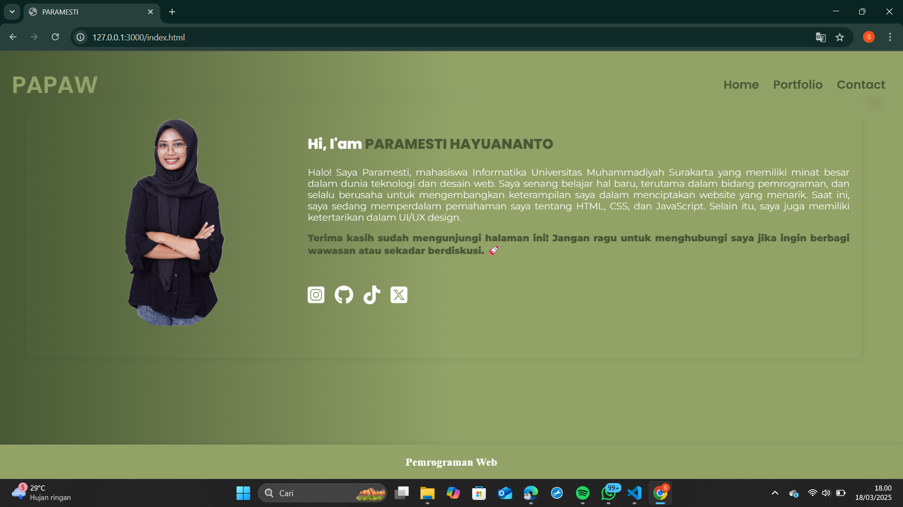
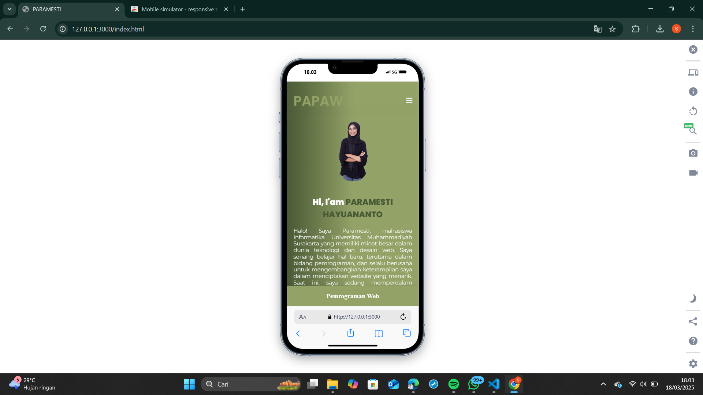
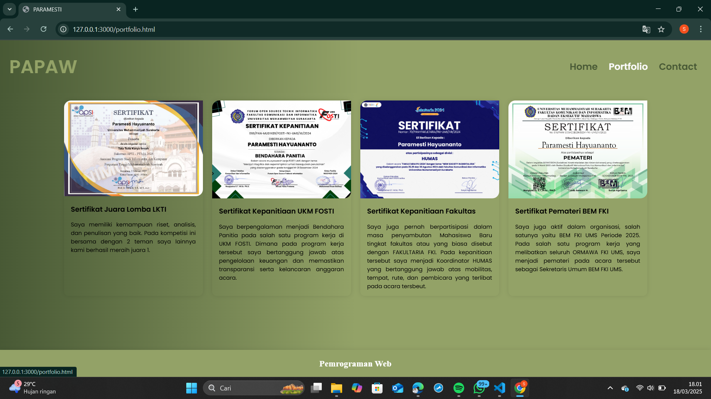
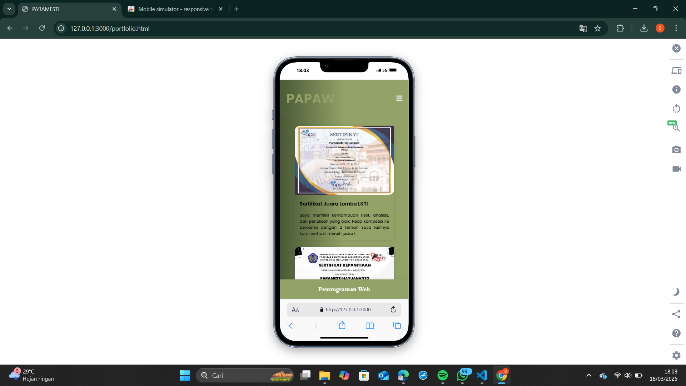
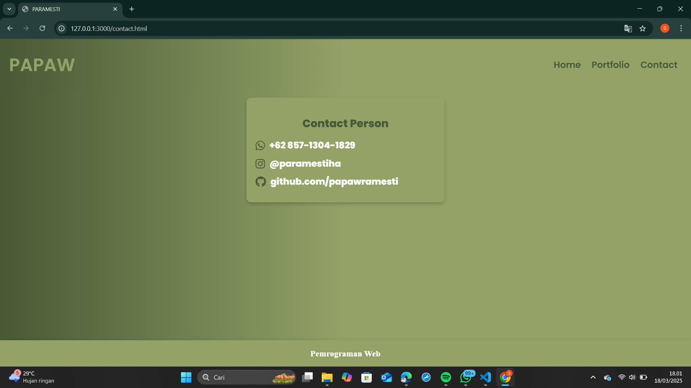
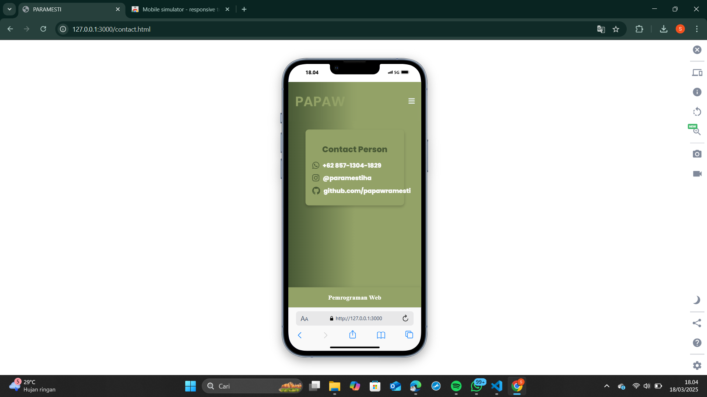

# LAPORAN TUGAS PEMROGRAMAN WEB MEMBUAT WEB PORTFOLIO

## Tujuan

Web ini dibuat untuk memenuhi tugas Mata Kuliah Pemrograman Web. Web ini merupakan web personal branding yang isinya meliputi deskripsi diri, pengalaman atau proyek yang pernah dibuat, dan sosial media.

## Fitur Utama

### 1. Halaman utama (Profil)

- **index.html** : Menampilkan foto dan deskripsi diri secara singkat

#### Tampilan Desktop

#### Tampilan Mobile

### 2. Halaman kedua (Portfolio)

- **portfolio.html** : Menampilkan project atau pengalaman apa saja yang pernah dimiliki

#### Tampilan Desktop

#### Tampilan Mobile

### 3. Halaman ketiga (Sosial media dan kontak)

- **contact.html** : Menampilkan kontak yang bisa dihubungi serta sosial media

#### Tampilan Desktop

#### Tampilan Mobile

## Teknologi yang digunakan

- HTML 5
- CSS 3

# STRUKTUR FOLDER

## Folder root

Berisi file dan subfolder sebagai berikut :

- index.html
- portfolio.html
- contact.html
- LAPORAN.md
- README.md
- README-en.md

## Subfolder

### 1. Folder asset

Folder ini berisi gambar ataupun asset yan diperlukan dalam pembuatan website, meliputi :

- **paw.png** : Foto profil pribadi
- **sertif.png** : Sertifikat yang pernah didapatkan

### 2. Folder style

Folder ini berisi file.css yang berfungsi untuk melakukan styling terhadap tag-tag html untuk membuat web semakin menarik dan interaktif.

- **style.css** : digunakan untuk styling semua file.html

### Link web hosting vercel

- [Web Paramesti Hayuananto](https://papaww-papawwws-projects.vercel.app/index.html)
